# PR3 Hotel Management System  

Software Engineers: Michael Granberry, Raymond Babayans, Ralph Frem, Ziv Gabay  

Our project will allow the front desk employee to perform necessary operations such as check-in/check-out of a guest, view a report of available/occupied rooms, and look up the name of a particular guest along with their room number. In terms of limitations, the hotel’s capacity is only 40 rooms, and it accepts guests who are 18 years or older. All the required information will be stored in a local or potentially online database.  

## Main Form  

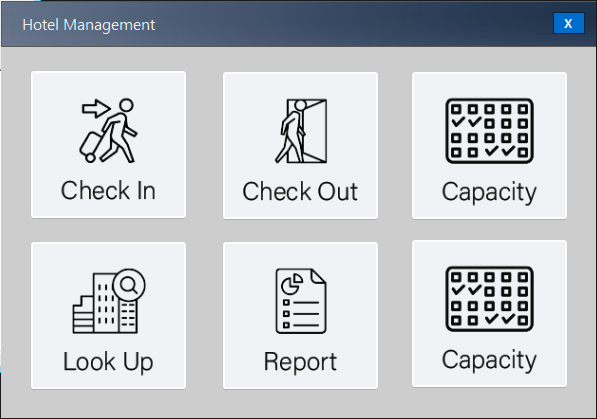  

## Check-In Form  

The guest check in page should allow for the end user to input guest information to check in the guest efficiently. This page should include the guest first name, last name, email address, phone number, number of beds, room #, length of stay, price, accommodations, and payment method to be entered. This section should also allow for a unique confirmation code that can be linked with their hotel key card.  

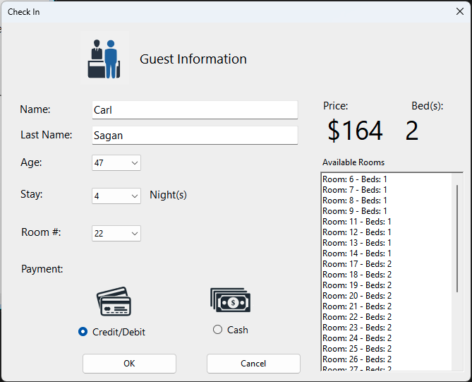  

* Confirmation Number  
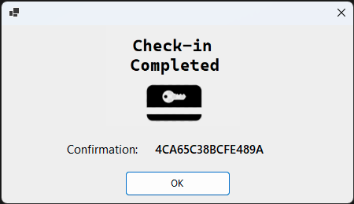  

* Guest Inserted Into Firebase Realtime Database  
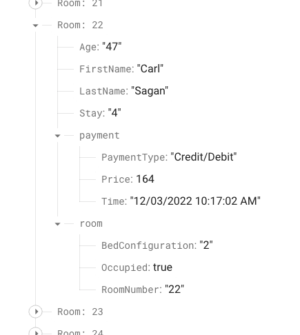  

### Capacity Form  

The Room Capacity page will allow the front desk staff to see the number of rooms available, as well as which rooms are occupied and which ones are available.  

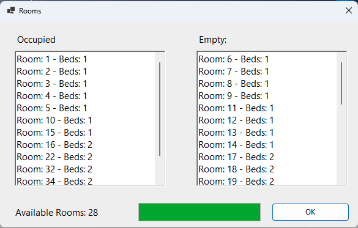  

## Look-Up Form  

The guest look up page will allow the front desk staff to search the guest list based on name/last name.  

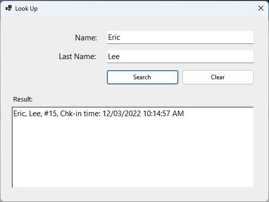  

## ReportForm  

The guest activity/report page will show a log of guests that have checked in and out, along with the time, their room#, payment method, etc. This graphical user interface should be clear and clean to the end user allowing for a seamless experience. Look up feature for the report will also be implemented.  
* Guest Log  
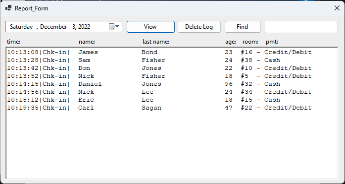  
* Search Log File  
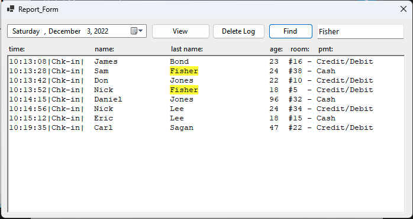  

## Room Estimation Form
The guest estimation page will allow the front desk staff to provide an estimated price to the guest depending on the numbers of stays and bed numbers.  
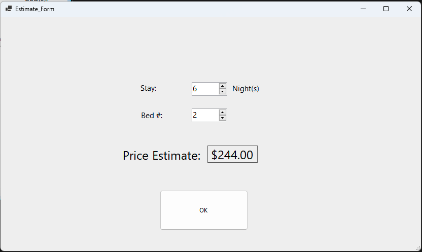  

## Check-Out Form

The guest check-out page will allow the front desk staff to perform checking out of a guest. On this page after selecting a room number, the guest is checked out.  
* Only Shows Occupied Rooms to be Checked-Out  
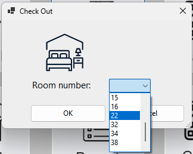  
* Check-Out Confirmation  
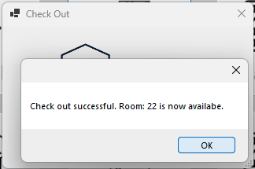  

