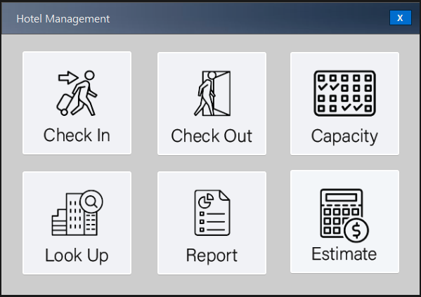

# PR3 Hotel Management System  

Software Engineers: Michael Granberry, Raymond Babayans, Ralph Frem, Ziv Gabay  

Our project will allow the front desk employee to perform necessary operations such as check-in/check-out of a guest, view a report of available/occupied rooms, and look up the name of a particular guest along with their room number. In terms of limitations, the hotel’s capacity is only 40 rooms, and it accepts guests who are 18 years or older. All the required information will be stored in a local or potentially online database.  

## UI  

### Main Form  

  

### Check-In Form  

* The guest check in page should allow for the end user to input guest information to check in the guest efficiently. This page should include the guest first name, last name, email address, phone number, number of beds, room #, length of stay, price, accommodations, and payment method to be entered. This section should also allow for a unique confirmation code that can be linked with their hotel key card.  

  

* Confirmation Number  
  

* Guest Inserted Into Firebase Realtime Database  
  

### Capacity Form  

  
